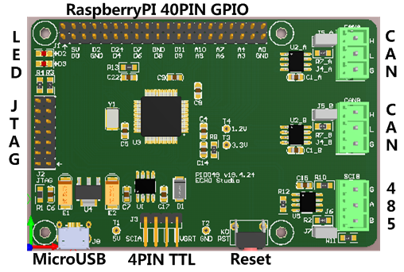

# PI0049

A TMS320F280049 Development Board which compatible with Raspberry PI.

## Summary of Resources:

- [User Manual PDF](DOC/PI0049_UM_v20.3.11.pdf)
- [Schematic PDF](SCH/PI0049_Sch_v19.4.24.pdf)
- [XBOOT Bootloader](https://github.com/xjtuecho/XBOOT/blob/master/FW/PI0049/XBOOT_v19.6.20_PI0049.hex)
- [XBOOT Command Line Reference](https://github.com/xjtuecho/XBOOT/blob/master/DOC/XBOOT_PI0049_CmdRef.md)
